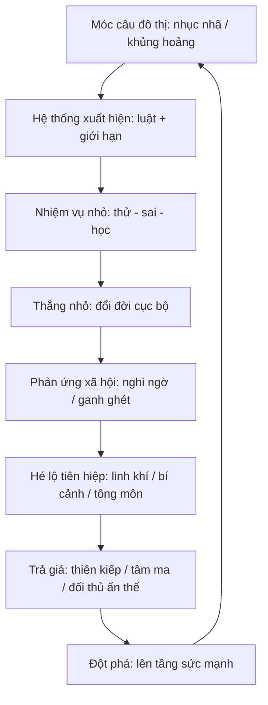
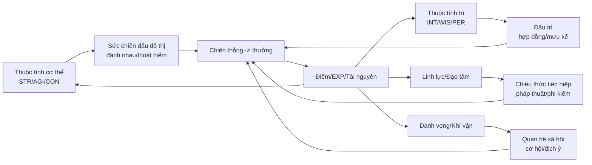

# Knowledge base phong cách viết truyện lai Tiên Hiệp + Đô Thị + Hệ Thống

## Tóm tắt điều hành

Truyện lai **Tiên hiệp + Đô thị + Hệ thống** là một nhánh của **tiểu thuyết mạng/đăng dài kỳ** (web novel/webserial), nơi độc giả kỳ vọng nhịp **serial nhanh**, nhiều “mốc” thăng tiến, và khoái cảm đọc đến từ **tiến bộ định lượng** (level/đẳng cấp/kỹ năng) lẫn **phản ứng xã hội định tính** (địa vị, tiền, danh, nể sợ). “Tiểu thuyết mạng” thường được hiểu là tác phẩm viết/đăng chủ yếu trên Internet và đăng theo kỳ (serial). citeturn6search3turn6search1

Trong cấu trúc lai này:
- **Tiên hiệp** cung cấp “trần sức mạnh” (ceiling) và cảm giác “đạo” (tu luyện–đột phá–phi thăng), vốn gắn với quan niệm **tiên/tiên nhân** trong truyền thống Đạo giáo (tu luyện lâu năm, thoát tục, trường sinh). citeturn0search1turn3search2  
- **Đô thị** cung cấp “trần xã hội”: luật chơi quyền lực đời thường (công sở, tài phiệt, trường học, mạng xã hội…), đặc biệt hợp với cơ chế đăng dài kỳ vì mâu thuẫn dễ tạo liên tục. Cách phân loại “urban novels/đô thị” cũng xuất hiện như một nhóm thể loại lớn trên các nền tảng web-novel như Qidian. citeturn6search4turn8search1  
- **Hệ thống** (gần với LitRPG/progression fantasy) cung cấp “bảng điều khiển”: tiến bộ hiển thị, nhiệm vụ, thưởng-phạt, khiến tiến trình trở nên **rõ ràng và có nhịp**. LitRPG nhấn mạnh yếu tố “RPG hiển thị” (chỉ số, level-up) như một phần thiết yếu của trải nghiệm đọc; progression fantasy nhấn mạnh việc nhân vật tăng sức mạnh có chủ đích và có thể đo/so sánh (quantifiable). citeturn0search3turn14search1  

Tài liệu này là **knowledge-base thực dụng** cho AI agent: định nghĩa + trope; công thức dung hợp theo arc; kỹ thuật văn phong “giống người”; archetype nhân vật; mẫu thiết kế hệ thống (kèm 3 mô hình so sánh và khoảng số gợi ý); template chương; và format dữ liệu/nhãn để huấn luyện.

## Định nghĩa và trope cốt lõi của từng nhánh

**Tiên hiệp (xianxia/tu tiên/tu chân)**  
Xianxia thường được mô tả là một thể loại kỳ ảo Trung Hoa chịu ảnh hưởng thần thoại và các dòng tư tưởng như Đạo giáo, Phật giáo, Nho giáo; nhân vật trung tâm thường là **người tu luyện** hướng tới **khai ngộ/tăng tiến/đạt bất tử**, đồng thời thế giới có thần–tiên–ma–quỷ, linh thú và pháp bảo. citeturn0search1turn1search0  
Trong khung Việt hóa, “tiên” gắn với hình tượng **tiên nhân** (tu luyện lâu năm, thoát trần tục, trường sinh) trong Đạo giáo. citeturn3search2  
Ví dụ “kinh điển” được nhắc nhiều trong cộng đồng/nguồn bách khoa: *Tru Tiên* là một tiểu thuyết tiên hiệp (bối cảnh tông phái chính–ma đối lập), cho thấy cấu trúc “môn phái–đạo thống–xung đột chính/tà” rất điển hình. citeturn3search1  
Một ví dụ khác về tác phẩm “đề tài tiên hiệp” phát hành mạng và có bản quyền xuất bản đa quốc gia là *Ma đạo tổ sư* (được ghi rõ “chủ đề tiên hiệp” và phát hành đầu tiên qua nền tảng mạng). citeturn3search3  
Một tác phẩm tu luyện nổi tiếng khác được Wikipedia mô tả là “online novel về immortal cultivation” đăng trên Qidian (2008–2013) là *A Record of a Mortal’s Journey to Immortality*, minh họa mô hình “tu luyện dài kỳ” điển hình. citeturn12search0  

**Trope tiên hiệp cần đóng gói thành “mẫu học” cho agent**  
Cốt lõi là “tiến cảnh giới” + “cơ duyên” + “đạo tâm”:
- **Cảnh giới/đột phá**: nhịp đếm được (đều đặn có “breakthrough”), nhưng phải gắn với **giá** (nguy cơ, tài nguyên, tâm ma, thiên kiếp) để không mất căng thẳng. (Đây là nguyên tắc thiết kế, không phải mô tả nguồn.)  
- **Cơ duyên & nhân quả**: tình cờ có vẻ “trời cho”, nhưng phải “hợp logic nội giới”: manh mối trước, điều kiện kích hoạt, và hậu quả sau.  
- **Tông môn–gia tộc–đạo thống**: cấu trúc xã hội theo sức mạnh (tôn ti rõ), dễ tạo đối kháng leo thang.  
- **Pháp bảo/linh đan/bí cảnh**: “đồ vật” là động cơ cốt truyện; mỗi món phải có *giới hạn sử dụng* để giữ nhịp.  

**Đô thị (urban/hiện đại)**  
Trong hệ sinh thái web-novel Trung Quốc, “urban novels/đô thị” là một nhóm phân loại rõ ràng trên các nền tảng lớn; Wikipedia về Qidian nêu khu vực tiểu thuyết trên site được phân theo genre, trong đó có **urban novels**. citeturn6search4  
Bản thân Qidian có trang xếp hạng/đề cử cho nhóm “都市” (đô thị), phản ánh đây là một “bể nội dung” riêng với nhịp cập nhật dày và nhiều nhánh như đời sống, công sở, gia đình, kinh doanh… citeturn8search1  
Vì nhiều tác phẩm thuộc loại này là **tiểu thuyết mạng đăng dài kỳ**, chúng chia sẻ đặc trưng của web novel: đăng theo kỳ, có dòng chảy dài, ưu tiên tính “kéo chương”. citeturn6search3turn6search1  

**Trope đô thị hay đi cùng hệ thống/tiên hiệp**  
- **Địa vị & nhục nhã xã hội**: bị coi thường, bị chèn ép (công ty/nhà vợ/giới thượng lưu), tạo nền cho “phản sát”.  
- **Tài phiệt–quan hệ–luật chơi**: ai đứng sau ai, lợi ích đổi chác; “quyền lực mềm” (tin đồn, truyền thông, clip, group chat).  
- **Tuyến đời thường**: ăn ở, đi làm, tiền nhà, bệnh viện, hợp đồng—đây là “neo thực tại” để khi tiên hiệp xuất hiện vẫn có cảm giác thật.  
- **Face-slapping (vả mặt)**: một thuật ngữ trope phổ biến trong web-novel, thường mô tả việc nhân vật bị bully lúc đầu rồi sau đó giả ngu/ẩn lực để đối phương tự lao vào và bị đánh bại công khai. citeturn14search6  

**Hệ thống (system/LitRPG-like)**  
LitRPG được mô tả là thể loại kết hợp quy ước RPG vào tiểu thuyết, trong đó “game-like elements” và **chỉ số hiển thị** là một phần quan trọng của trải nghiệm. citeturn0search3  
Progression fantasy là phân nhánh fantasy nhấn mạnh việc nhân vật tăng sức mạnh có chủ đích và có thể định lượng. citeturn14search1  
Trong thực hành “truyện hệ thống” ở mạch Tiên hiệp + Đô thị, hệ thống thường đóng vai:
- **Máy phát nhịp**: tạo nhiệm vụ/điểm mốc giữa chương.  
- **Máy tạo lựa chọn**: thưởng-phạt, cooldown, trade-off.  
- **Máy định nghĩa công bằng nội tại**: nhân vật “có lý do” để mạnh dần (tránh cảm giác tác giả thiên vị).  

## Công thức dung hợp: khung cốt truyện, nhịp kể, nhịp cảm xúc

Dưới đây là 3 “công thức dung hợp” phổ biến, viết theo dạng *mẫu suy luận* để agent có thể chọn và triển khai nhất quán.

**Công thức A: Đô thị làm sân khấu, hệ thống làm động cơ, tiên hiệp làm trần sức mạnh**  
- *Bắt đầu*: nhân vật ở đáy xã hội đô thị (bị chèn ép).  
- *Kích hoạt*: hệ thống xuất hiện để giải bài toán đời thường trước (tiền, sức khỏe, địa vị), nhưng dần “hé” phần tu luyện.  
- *Mở rộng*: từ kỹ năng đời thường → năng lực siêu phàm → bước vào tầng tu luyện/đạo thống.

**Công thức B: Cao thủ/tu sĩ rơi về đô thị (thoái tu/luân hồi), hệ thống là “bản vá”**  
- *Bắt đầu*: nhân vật từng là tu sĩ, nay về hiện đại (hoặc mất tu vi).  
- *Kịch tính*: biết quá nhiều nhưng lực bất tòng tâm; hệ thống bù lại và tạo thử thách.  
- *Chìa khóa*: xung đột “đạo tâm cổ điển” vs “đạo lý đời thường hiện đại”.

**Công thức C: Đô thị dị năng + hệ thống, tiên hiệp chỉ là “đỉnh băng”**  
- *Bắt đầu*: thế giới hiện đại có linh khí phục hồi/ẩn thế.  
- *Hệ thống*: tối ưu hóa năng lực (thẻ kỹ năng, bảng thuộc tính).  
- *Tiên hiệp*: xuất hiện muộn như “tầng vũ trụ”: tông môn, bí cảnh, thiên kiếp.

### Nhịp theo arc gợi ý

Vì tiểu thuyết mạng thường đăng dài kỳ, mẫu nhịp theo arc giúp agent tránh “chạy một màu” (toàn đánh nhau hoặc toàn bảng chỉ số). “Tiểu thuyết mạng” vốn có đặc trưng đăng dài kỳ (webserial) nên arc cần tự khép kín tương đối để giữ retention. citeturn6search3  

| Arc (mục tiêu đọc) | Độ dài gợi ý | Tỷ lệ Đô thị : Hệ thống : Tiên hiệp | Trọng tâm căng thẳng | “Khoái cảm” chính |
|---|---:|---|---|---|
| Hook & đáy xã hội | 5–20 chương | 60 : 30 : 10 | Nhục nhã, thiếu tiền/quyền, bị ép | Hứa hẹn “đổi đời” |
| Chứng minh hệ thống | 20–60 | 45 : 40 : 15 | Nhiệm vụ 1–2, thưởng nhỏ nhưng hữu dụng | Thấy tiến bộ đo được |
| Bẻ gãy trần xã hội | 60–150 | 40 : 35 : 25 | Đối thủ “đời thường” sụp | Vả mặt công khai (face-slapping) citeturn14search6 |
| Hé lộ đạo thống | 150–300 | 25 : 30 : 45 | Bí mật ẩn thế, tông môn, thiên kiếp | Awe (choáng ngợp) |
| Tái cân bằng | 300+ | tùy | Kẻ mạnh mới, luật chơi mới | “Thế giới rộng hơn” |

### Nhịp cảm xúc phải “lượn sóng” (beat map)

Để viết “giống người”, agent cần map cảm xúc theo chu kỳ ngắn (chương) và dài (arc):

- **Chu kỳ chương (5 beat)**: bực/nhục → lóe hy vọng → căng thẳng chọn lựa → thỏa mãn chiến thắng nhỏ → dư âm bất an (mở móc câu).  
- **Chu kỳ arc (7 beat)**: đáy → cơ duyên → học luật → trả giá → thắng đậm → phản đòn lớn → đổi tầng luật chơi.



Vòng lặp ở cuối (H → A) là “serial engine”: mỗi lần lên tầng, lại có “đáy mới” tương ứng (kẻ mạnh hơn, luật chơi rộng hơn).

## Văn phong giống người: kỹ thuật và bẫy “AI-sounding”

Muốn “giống người”, agent **không chỉ học trope** mà phải học *nhịp câu, điểm nhìn, và độ mơ hồ hợp lý*.

**Độc thoại nội tâm có kiểm soát**  
“Interior monologue/độc thoại nội tâm” là kỹ thuật cho thấy dòng nghĩ và cảm xúc đi qua đầu nhân vật, có thể là ấn tượng rời rạc hoặc chuỗi suy nghĩ có cấu trúc. citeturn11search0  
Trong truyện lai này, độc thoại nội tâm đặc biệt hữu dụng để:
- Neo đời thường (đô thị) bằng những lo nhỏ: tiền, mặt mũi, sợ bị quay clip.  
- Chuyển mạch “hệ thống”: biến popup chỉ số thành cảm giác thật (rụng tim, nghi ngờ, ham muốn).  
- Giữ “đạo tâm”: khi tiên hiệp xuất hiện, nội tâm thể hiện lựa chọn đạo đức/nhân quả.

**Biến hóa câu dài–câu ngắn và nhịp đoạn**  
Bẫy AI thường là: câu đều đều, giải thích cân bằng quá mức, không có “nhịp thở”. Để khắc phục:
- Dùng **câu ngắn** cho cảm giác sốc/đột ngột: “Không phải mơ.” “Lạnh gáy.”  
- Dùng **câu dài** để kéo cảm xúc/quan sát đô thị: âm thanh điều hòa, ánh đèn hành lang, mùi cà phê cũ.  
- Dùng **đoạn siêu ngắn** (1 dòng) đúng chỗ để tạo nhịp đọc serial.

**Thiết bị tu từ dùng như gia vị, không phải phô diễn**  
Biện pháp tu từ là cách phối hợp ngôn ngữ để đạt mục đích nghệ thuật; đây là “kho dụng cụ” (ẩn dụ, so sánh, nói quá, đối lập…). citeturn3search6  
Quy tắc cho agent: mỗi cảnh chỉ cần 1–2 thủ pháp nổi bật; quá tay sẽ thành “làm văn”.

**Điểm nhìn & giọng điệu nhất quán**  
Trong trần thuật, điểm nhìn và giọng điệu góp phần xây dựng nhân vật và phong cách kể. citeturn10search7  
Mẹo vận hành trong truyện lai:
- Đô thị: giọng trực diện, có chút “cay” đời.  
- Tiên hiệp: giọng chậm lại, tăng độ trang trọng vừa phải, nhưng tránh “cổ văn giả”.  
- Hệ thống: giọng rõ ràng, như log/notification, đối lập với giọng đời thường để tạo hiệu ứng.

### Các bẫy “AI-sounding” thường gặp và cách sửa

| Bẫy | Dấu hiệu | Cách sửa theo hướng “người thật” |
|---|---|---|
| Giải thích thay vì kể | 2–3 đoạn liên tiếp “vì… nên…” | Chuyển sang hành vi + cảm giác + hệ quả xã hội |
| Hoàn hảo hóa logic | Không có sai lầm, không có trả giá | Cho nhân vật chọn sai / trả phí / hối hận |
| Từ ngữ trơn tru quá mức | Câu nào cũng “đẹp”, không có vấp | Thêm nhịp nói thật: ngập ngừng, tự mắng, lạc ý |
| Lặp cấu trúc | Chương nào cũng “đánh–nhận thưởng–vả mặt” | Xen kẽ chương “neo đời thường”, chương “bí mật”, chương “thua có kiểm soát” |
| Nhân vật “biết hết” | Độc giả thấy bị dạy đời | Để nhân vật đoán sai 30–40% và học dần |

### Snippet minh họa tiếng Việt: dở (AI) vs giống người

**Ví dụ về nhịp câu + cảm giác**

Bad (AI-sounding):
> Anh ta rất tức giận vì bị xúc phạm, nhưng anh ta cố gắng bình tĩnh để giải quyết vấn đề một cách hợp lý.

Human-like:
> Máu nóng bốc lên tới tai.  
> Nhưng ngay lúc đó, anh nhìn thấy cái điện thoại đang chĩa về phía mình.  
> “Bình tĩnh.” Anh tự nhắc. Không phải vì cao thượng—vì sợ ngày mai tên mình nằm trên group công ty.

**Ví dụ về hệ thống “đi vào thân thể”**

Bad:
> Hệ thống đã xuất hiện và cung cấp cho nhân vật một nhiệm vụ.

Human-like:
> Một dòng chữ bật giữa không trung như ai đó dí thẳng vào tròng mắt: **NHIỆM VỤ MỚI**.  
> Anh chớp liên tục. Tim đập hụt một nhịp.  
> *Mình… mất ngủ quá nên hoa mắt à?* citeturn11search0  

**Ví dụ về face-slapping không nói thẳng “vả mặt”**

Bad:
> Anh quyết định vả mặt họ để chứng minh mình mạnh.

Human-like:
> Anh không phản bác.  
> Anh ký. Anh cười.  
> Đến lúc đối phương giơ hợp đồng lên khoe, dấu đỏ mới hiện ra—một dấu mà chỉ người trong nghề mới biết là… vô hiệu.

(“Face-slapping” như trope thường là nhử đối phương tự lao vào rồi sụp công khai.) citeturn14search6  

## Nhân vật: archetype, chu kỳ phát triển và ví dụ

Trong web-novel tu luyện dài kỳ, archetype quan trọng vì nó là “máy phát tình huống”. Ví dụ, *A Record of a Mortal’s Journey to Immortality* được mô tả là câu chuyện về một “cậu bé nghèo, bình thường” tham gia một môn phái nhỏ và tìm cách đứng vững, trở thành bất tử; đây là mẫu **phàm nhân–tu luyện–tồn tại** kinh điển. citeturn12search13turn12search0  

### Bộ archetype cốt lõi cho truyện lai

**Phàm nhân cơ duyên (underdog thực dụng)**  
Đầu vào: yếu, nghèo, ít quan hệ.  
Động lực: sống sót/đổi đời trước, đạo lý sau.  
Hợp: Đô thị + hệ thống + tu luyện “từng bước”.

**Thiên tài bị phế / bị oan (fallen genius)**  
Đầu vào: từng ở đỉnh, rơi xuống đáy.  
Động lực: lấy lại mọi thứ, nhưng tránh “ngạo mạn ảo”.  
Hợp: Tiên hiệp nặng “đạo tâm”, đô thị làm tầng nhục nhã.

**Cao thủ xuống núi (hidden powerhouse)**  
Đầu vào: mạnh/khác thường ngay từ đầu.  
Rủi ro: dễ “mất căng” nếu thắng quá dễ.  
Cách cứu: hệ thống ép trade-off; đô thị ép “hậu quả pháp lý/xã hội”.

**Kẻ hai mặt / phản anh hùng (masking antiheroes)**  
Đầu vào: biết đóng vai, giấu bài.  
Hợp: face-slapping tinh tế + đấu trí công sở.

**Bạn đồng hành đô thị (anchor character)**  
Vai trò: neo đời thường, làm thước đo “cái gì là bất thường”.  
Công dụng: phản ứng tự nhiên thay cho lời giải thích của tác giả.

**Kẻ thù theo tầng (tiered antagonists)**  
Đô thị: sếp, nhà vợ, đối thủ kinh doanh.  
Ẩn thế: bảo an tông môn, người canh cổng bí cảnh.  
Tầng cao: thiên kiếp/đạo thống.

### Chu kỳ phát triển nhân vật theo “vòng lặp tăng cấp + trả giá”

Để tránh “main vô cảm/vô địch vô lý”, agent nên triển khai chu kỳ 8 bước:

1) Thiếu thốn cụ thể (tiền/địa vị/sức khỏe)  
2) Bị ép vào lựa chọn xấu (mất mặt/đền hợp đồng/bị đuổi việc)  
3) Hệ thống đưa điều kiện (nhiệm vụ có giới hạn, có deadline)  
4) Thử sai (thất bại nhỏ, bị cảnh cáo/phạt)  
5) Học luật (độc thoại nội tâm: hiểu vì sao mình sai) citeturn11search0  
6) Thắng nhỏ (đổi đời cục bộ)  
7) Phản ứng xã hội (nghi ngờ/ganh ghét/đồn thổi)  
8) Đối thủ nâng hạng (mở arc mới)

**Ví dụ ngắn (mang tính minh họa, không trích tác phẩm)**  
- Arc 1: bị dìm KPI → nhiệm vụ “tăng uy tín” → thất bại vì nóng vội → học cách dùng bằng chứng/đúng quy trình → thắng hợp đồng nhỏ → sếp lộ mặt thật → arc 2.

## Thiết kế hệ thống: mẫu kiến trúc, so sánh mô hình và khoảng số gợi ý

LitRPG nhấn mạnh việc “cơ chế game” phải **hiển thị và quan trọng** trong trải nghiệm đọc. citeturn0search3  
Một cách nhìn thiết kế (từ cộng đồng viết LitRPG) mô tả “hệ thống” như cơ chế: nếu người dùng làm theo cách hệ thống muốn, họ được thưởng; do đó hệ thống phải có **lý do tồn tại** và hướng hành vi nhân vật. citeturn15search0  

### Kiến trúc hệ thống tối thiểu để viết bền

**Lớp hiển thị (UI/Log)**  
Thông báo, bảng thuộc tính, nhật ký nhiệm vụ. Mục tiêu: *tạo nhịp* và *tạo khoái cảm thấy tiến bộ*.

**Lớp luật (Rules)**  
- Điều kiện kích hoạt  
- Giới hạn (cooldown, cap)  
- Chống lạm dụng (anti-exploit)  
- Giá phải trả (penalty/trade-off)

**Lớp kinh tế (Economy)**  
Điểm, vật phẩm, tài nguyên tu luyện, tiền đô thị—tất cả phải đổi qua lại có ma sát.

**Lớp tích hợp thế giới (Lore binding)**  
Hệ thống là gì? AI vũ trụ? truyền thừa? thiên đạo? Nếu không nói rõ ngay, phải cài “bằng chứng nhỏ” dần để về sau hé lộ hợp lý (nguyên tắc “cơ duyên có nhân quả”). citeturn0search1  

### Pattern thuộc tính–kỹ năng–cảnh giới



### Bảng so sánh 3 mô hình hệ thống (kèm khoảng số gợi ý)

Các khoảng số dưới đây là **đề xuất thiết kế** để giữ căng thẳng và tránh “phồng số” quá sớm (không phải mô tả chuẩn chung của mọi truyện).

| Thành phần | Conservative (khắt khe) | Balanced (đọc sướng nhưng còn căng) | Exploitative (dễ “bá”/nhanh) | Ghi chú vận hành |
|---|---|---|---|---|
| EXP/điểm mỗi nhiệm vụ thường | 1–5 | 5–25 | 20–100 | Dành “nhiệm vụ lớn” cho mốc arc |
| Tăng thuộc tính mỗi cấp | +1 (hoặc +0.5) | +1 đến +3 | +3 đến +10 | Nếu tăng nhanh, phải có “hậu quả xã hội” mạnh hơn |
| Cooldown kỹ năng chủ lực | 24–72h (in-story) | 6–24h | 0–6h | Cooldown là công cụ giữ nhịp chương |
| tỷ lệ nhiệm vụ thất bại (chấp nhận được) | 30–50% | 15–30% | 0–10% | Thất bại nhỏ giúp “người thật” hơn citeturn11search0 |
| Penalty khi fail | Mất điểm/đau/giảm uy tín | Mất điểm nhẹ/khóa thưởng | Gần như không | Penalty phải “đáng sợ” để nhiệm vụ có giá trị citeturn15search0 |
| “Vật phẩm phá game” | Hiếm, 1/arc | Vừa, 2–3/arc | Nhiều | Nếu nhiều thì chuyển trọng tâm sang “địch cũng phá game” |
| Trần sức mạnh đô thị | Tăng chậm | Tăng đều | Tăng nhanh | Sớm muộn phải mở “ẩn thế/tiên hiệp” để có kẻ mạnh mới citeturn6search4turn0search1 |

### Mẫu nhiệm vụ và trade-off để dính “đô thị” lẫn “đạo”

Để hệ thống không chỉ là bảng số, nhiệm vụ nên có **giá đạo đức/xã hội**:
- Nhiệm vụ “tăng danh vọng” nhưng buộc phải đứng ra nhận trách nhiệm thay đồng đội.  
- Nhiệm vụ “tăng linh lực” nhưng phải từ chối một hợp đồng bẩn (mất tiền).  
- Nhiệm vụ “thức tỉnh công pháp” nhưng yêu cầu “đoạn một chấp niệm” (tạo xung đột tình cảm).

(Đây là khuyến nghị thiết kế; hệ thống càng ép lựa chọn, truyện càng có “độ người”.)

## Khuôn chương, micro-structure và format dữ liệu huấn luyện cho AI agent

### Template nhịp một chương (chapter micro-structure)

Mục tiêu: mỗi chương giống một “đơn vị serial” tự có khoái cảm, nhưng vẫn đẩy arc.

**Mở đầu (hook 5–15 dòng)**  
- Một cú “đời thường” có nguy cơ: bị gọi lên phòng sếp, hóa đơn viện phí, bị quay clip, bị nhà vợ sỉ nhục.  
- Hoặc một cú “dị thường”: linh khí thoáng qua, vật thể rung, giấc mơ có ký ức tu sĩ.  
Gợi ý: hook nên gắn với mô thức web-serial (đọc nhanh, vào thẳng vấn đề). citeturn6search3  

**Thân đầu (thiết lập xung đột + mục tiêu nhỏ)**  
- Nêu mục tiêu 1 câu: “Hôm nay phải ký được hợp đồng / phải giữ việc / phải cứu người.”

**Giữa chương (system beat bắt buộc)**  
- Hệ thống xuất hiện theo 1 trong 3 kiểu:
  1) *Popup luật*: nhiệm vụ + deadline  
  2) *Popup trả giá*: cảnh cáo, penalty, cooldown  
  3) *Popup tiến bộ*: cộng điểm/đột phá nhỏ  
LitRPG coi yếu tố hiển thị và cơ chế là trung tâm trải nghiệm; vì vậy “system beat” cần xuất hiện thường xuyên nhưng không phải lúc nào cũng dài. citeturn0search3  

**Cuối chương (cliffhanger 1–3 nhát)**  
- Lật mặt đối thủ / phát hiện tầng cao hơn / nhiệm vụ mới khó hơn / “ẩn thế” nhìn thấy nhân vật.  
Mẹo: kết bằng *hành động hoặc hình ảnh*, tránh kết bằng giải thích.

### Checklist đánh giá chương “đúng chất lai”

1) Có ít nhất 1 neo đời thường (đô thị) cụ thể.  
2) Có ít nhất 1 lựa chọn có giá (trade-off) hoặc hậu quả. citeturn15search0  
3) Có “system beat” rõ ràng (nhiệm vụ/thưởng-phạt/cooldown). citeturn0search3  
4) Có bước tiến (định lượng hoặc định tính) phục vụ progression. citeturn14search1  
5) Có biến hóa nhịp câu (ít nhất 1 đoạn ngắn 1 dòng, 1 đoạn câu dài).  
6) Có độc thoại nội tâm hoặc phản ứng cảm giác (tránh “tôi kể lại” khô). citeturn11search0  
7) Kết chương mở móc (không khép kín hoàn toàn).

### Format dữ liệu huấn luyện cho agent

Mục tiêu: tạo tập dữ liệu để agent học **(a) cấu trúc**, **(b) giọng kể**, **(c) nhịp hệ thống**, **(d) tính “người thật”**.

**Đề xuất schema JSONL (mỗi dòng = 1 đoạn hoặc 1 cảnh)**

```json
{
  "id": "arc1_ch12_scene2",
  "subgenre_mix": {"tien_hiep": 0.2, "do_thi": 0.6, "he_thong": 0.2},
  "scene_type": "workplace_conflict",
  "pov": "third_limited",
  "tone": ["cay_doi", "cang_thang"],
  "hook_type": "humiliation_public",
  "system_event": {
    "type": "quest_popup",
    "visibility": "explicit_ui",
    "cooldown_hours": 24,
    "penalty": "reputation_down"
  },
  "progress_marker": {
    "quant": {"lvl": 3, "exp_gain": 12},
    "qual": ["boss_attention", "social_status_shift_minor"]
  },
  "emotion_beats": ["shame", "anger", "calculation", "hope", "unease"],
  "style_features": {
    "avg_sentence_len": 9.8,
    "sentence_len_std": 6.1,
    "internal_monologue_ratio": 0.22,
    "sensory_density": 0.15,
    "rhetorical_devices": ["doi_lap", "an_du"]
  },
  "humanlikeness_label": "high",
  "text": "..."
}
```

**Gợi ý nhãn & hướng dẫn annotate (ngắn, rõ cho labeler)**  
- `hook_type`: humiliation / debt / threat / mystery / system_glitch  
- `system_event.type`: quest / reward / penalty / upgrade / lore_hint  
- `emotion_beats`: dùng danh sách cố định 20–30 cảm xúc để nhất quán  
- `humanlikeness_label`: low/medium/high dựa trên: có nhịp câu, có mơ hồ hợp lý, có phản ứng cảm giác, không “giải thích thay kể”.

**Ví dụ annotate mini (đoạn tự tạo minh họa)**

```json
{"id":"ex1","hook_type":"debt","system_event":{"type":"penalty","cooldown_hours":48},"emotion_beats":["panic","calculation","relief","unease"],"humanlikeness_label":"high","text":"Anh nhìn tin nhắn ngân hàng, số âm đỏ chót..."}
{"id":"ex2","hook_type":"humiliation_public","system_event":{"type":"reward","exp_gain":5},"emotion_beats":["shame","anger","satisfaction"],"humanlikeness_label":"medium","text":"Họ cười. Anh không cười lại..."}
```

### Ghi chú nguồn “kinh điển” để agent học trope (không dùng trích dài)

Nếu cần gợi ý “mỏ trope” để agent học cấu trúc (không trích nguyên văn dài vì bản quyền), các trang bách khoa/tổng quan có thể dùng làm neo:  
- Định nghĩa và đặc trưng xianxia (tiên hiệp) và “cultivation” trong lịch sử thể loại. citeturn0search1turn1search0  
- Khung “tiểu thuyết mạng/webserial” và đặc tính đăng dài kỳ. citeturn6search3turn6search1  
- LitRPG (chỉ số hiển thị, cơ chế RPG là trung tâm). citeturn0search3  
- Progression fantasy (tăng sức mạnh định lượng là trọng tâm). citeturn14search1  
- Qidian như ví dụ nền tảng phân loại có “urban novels” (đô thị) và hệ sinh thái cập nhật dày. citeturn6search4turn8search1